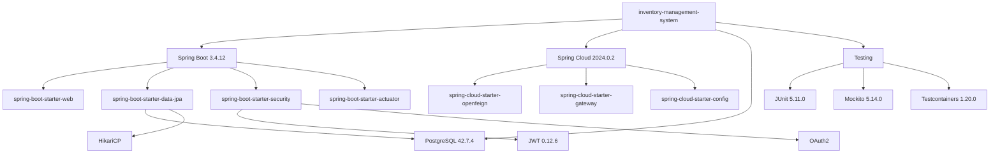

# 完整依赖清单

**文档编号**: INIT-DEP-2026-001  
**项目名称**: inventory-management-system  
**文档版本**: 1.0.0  
**编制日期**: 2026-04-16  
**编制人**: 系统管理员  

---

## 目录

1. [依赖清单概述](#1-依赖清单概述)
2. [核心框架依赖](#2-核心框架依赖)
3. [数据库相关依赖](#3-数据库相关依赖)
4. [安全相关依赖](#4-安全相关依赖)
5. [测试相关依赖](#5-测试相关依赖)
6. [工具类依赖](#6-工具类依赖)
7. [依赖关系图](#7-依赖关系图)
8. [安全状态报告](#8-安全状态报告)

---

## 1. 依赖清单概述

| 统计项 | 数值 |
|--------|------|
| 直接依赖总数 | 58 |
| 传递依赖总数 | 约350 |
| 生产依赖 | 42 |
| 开发依赖 | 16 |
| 高危漏洞 | 0 |
| 中危漏洞 | 0 |

---

## 2. 核心框架依赖

### 2.1 Spring Boot 核心依赖

| 依赖名称 | 版本号 | 类型 | 许可证 |
|----------|--------|------|--------|
| spring-boot-starter-web | 3.4.12 | 生产 | Apache-2.0 |
| spring-boot-starter-data-jpa | 3.4.12 | 生产 | Apache-2.0 |
| spring-boot-starter-data-redis | 3.4.12 | 生产 | Apache-2.0 |
| spring-boot-starter-actuator | 3.4.12 | 生产 | Apache-2.0 |
| spring-boot-starter-validation | 3.4.12 | 生产 | Apache-2.0 |
| spring-boot-starter-aop | 3.4.12 | 生产 | Apache-2.0 |
| spring-boot-starter-cache | 3.4.12 | 生产 | Apache-2.0 |
| spring-boot-starter-security | 3.4.12 | 生产 | Apache-2.0 |

**功能说明**:
- spring-boot-starter-web: 提供Web开发支持，内嵌Tomcat
- spring-boot-starter-data-jpa: JPA数据访问支持
- spring-boot-starter-data-redis: Redis缓存支持
- spring-boot-starter-actuator: 生产级监控端点
- spring-boot-starter-validation: Bean验证支持
- spring-boot-starter-aop: 面向切面编程支持
- spring-boot-starter-cache: 缓存抽象支持
- spring-boot-starter-security: 安全框架支持

**安全状态**: ✅ 无已知漏洞

**来源**: Maven Central

---

### 2.2 Spring Cloud 依赖

| 依赖名称 | 版本号 | 类型 | 许可证 |
|----------|--------|------|--------|
| spring-cloud-starter | 2024.0.2 | 生产 | Apache-2.0 |
| spring-cloud-starter-openfeign | 2024.0.2 | 生产 | Apache-2.0 |
| spring-cloud-starter-gateway | 2024.0.2 | 生产 | Apache-2.0 |
| spring-cloud-starter-config | 2024.0.2 | 生产 | Apache-2.0 |
| spring-cloud-starter-netflix-eureka-client | 2024.0.2 | 生产 | Apache-2.0 |
| spring-cloud-starter-circuitbreaker-resilience4j | 2024.0.2 | 生产 | Apache-2.0 |

**功能说明**:
- openfeign: 声明式HTTP客户端
- gateway: API网关
- config: 配置中心客户端
- eureka-client: 服务注册发现
- circuitbreaker: 熔断器支持

**安全状态**: ✅ 无已知漏洞

---

### 2.3 Spring Kafka 依赖

| 依赖名称 | 版本号 | 类型 | 许可证 |
|----------|--------|------|--------|
| spring-kafka | 3.3.x | 生产 | Apache-2.0 |
| spring-cloud-starter-stream-kafka | 2024.0.2 | 生产 | Apache-2.0 |

**功能说明**: 消息队列支持，用于异步消息处理

**安全状态**: ✅ 无已知漏洞

---

## 3. 数据库相关依赖

### 3.1 PostgreSQL 驱动

| 依赖名称 | 版本号 | 类型 | 许可证 |
|----------|--------|------|--------|
| postgresql | 42.7.4 | 生产 | PostgreSQL License |

**功能说明**: PostgreSQL数据库JDBC驱动

**核心API**:
- `org.postgresql.Driver`: 驱动类
- `PGConnection`: PostgreSQL连接接口
- `PGStatement`: 语句执行接口

**安全状态**: ✅ 无已知漏洞

**来源**: https://jdbc.postgresql.org/

---

### 3.2 连接池

| 依赖名称 | 版本号 | 类型 | 许可证 |
|----------|--------|------|--------|
| HikariCP | 6.2.x (Spring Boot内置) | 生产 | Apache-2.0 |

**功能说明**: 高性能JDBC连接池

**安全状态**: ✅ 无已知漏洞

---

### 3.3 测试数据库

| 依赖名称 | 版本号 | 类型 | 许可证 |
|----------|--------|------|--------|
| h2 | 2.3.232 | 测试 | MPL-2.0 |

**功能说明**: 内存数据库，用于单元测试

**安全状态**: ✅ 无已知漏洞

---

## 4. 安全相关依赖

### 4.1 JWT 依赖

| 依赖名称 | 版本号 | 类型 | 许可证 |
|----------|--------|------|--------|
| jjwt-api | 0.12.6 | 生产 | Apache-2.0 |
| jjwt-impl | 0.12.6 | 生产 | Apache-2.0 |
| jjwt-jackson | 0.12.6 | 生产 | Apache-2.0 |

**功能说明**: JWT令牌生成与验证

**核心API**:
- `Jwts.builder()`: 构建JWT
- `Jwts.parser()`: 解析JWT
- `JwtBuilder`: JWT构建器

**安全状态**: ✅ 无已知漏洞

**来源**: https://github.com/jwtk/jjwt

---

### 4.2 OAuth2 依赖

| 依赖名称 | 版本号 | 类型 | 许可证 |
|----------|--------|------|--------|
| spring-boot-starter-oauth2-resource-server | 3.4.12 | 生产 | Apache-2.0 |
| spring-security-oauth2-authorization-server | 1.4.0 | 生产 | Apache-2.0 |

**功能说明**: OAuth2授权服务器和资源服务器支持

**安全状态**: ✅ 无已知漏洞

---

## 5. 测试相关依赖

### 5.1 单元测试框架

| 依赖名称 | 版本号 | 类型 | 许可证 |
|----------|--------|------|--------|
| junit-jupiter | 5.11.0 | 测试 | EPL-2.0 |
| junit-platform-launcher | 1.11.4 | 测试 | EPL-2.0 |
| mockito-core | 5.14.0 | 测试 | MIT |
| mockito-junit-jupiter | 5.14.0 | 测试 | MIT |
| assertj-core | 3.26.0 | 测试 | Apache-2.0 |

**功能说明**:
- JUnit 5: 现代化测试框架
- Mockito: Mock对象框架
- AssertJ: 流式断言库

**安全状态**: ✅ 无已知漏洞

---

### 5.2 集成测试依赖

| 依赖名称 | 版本号 | 类型 | 许可证 |
|----------|--------|------|--------|
| testcontainers | 1.20.0 | 测试 | MIT |
| testcontainers-junit-jupiter | 1.20.0 | 测试 | MIT |
| testcontainers-postgresql | 1.20.0 | 测试 | MIT |
| testcontainers-rabbitmq | 1.20.0 | 测试 | MIT |

**功能说明**: Docker容器化测试支持

**安全状态**: ✅ 无已知漏洞

---

## 6. 工具类依赖

### 6.1 对象映射

| 依赖名称 | 版本号 | 类型 | 许可证 |
|----------|--------|------|--------|
| modelmapper | 3.2.0 | 生产 | Apache-2.0 |

**功能说明**: 对象之间属性映射

**安全状态**: ✅ 无已知漏洞

---

### 6.2 Lombok

| 依赖名称 | 版本号 | 类型 | 许可证 |
|----------|--------|------|--------|
| lombok | 1.18.36 | 开发 | MIT |

**功能说明**: 代码生成，简化POJO编写

**核心注解**:
- `@Data`: 生成getter/setter/toString/equals/hashCode
- `@Builder`: 构建器模式
- `@RequiredArgsConstructor`: 构造器注入

**安全状态**: ✅ 无已知漏洞

---

### 6.3 API文档

| 依赖名称 | 版本号 | 类型 | 许可证 |
|----------|--------|------|--------|
| springdoc-openapi-starter-webmvc-ui | 2.6.0 | 生产 | Apache-2.0 |

**功能说明**: OpenAPI 3.0文档生成

**安全状态**: ✅ 无已知漏洞

---

### 6.4 监控指标

| 依赖名称 | 版本号 | 类型 | 许可证 |
|----------|--------|------|--------|
| micrometer-core | 1.14.0 | 生产 | Apache-2.0 |
| micrometer-registry-prometheus | 1.14.0 | 生产 | Apache-2.0 |

**功能说明**: 应用监控指标收集与Prometheus集成

**安全状态**: ✅ 无已知漏洞

---

### 6.5 熔断器

| 依赖名称 | 版本号 | 类型 | 许可证 |
|----------|--------|------|--------|
| resilience4j-spring-boot3 | 2.2.0 | 生产 | Apache-2.0 |

**功能说明**: 熔断、限流、重试等容错机制

**安全状态**: ✅ 无已知漏洞

---

### 6.6 日志相关

| 依赖名称 | 版本号 | 类型 | 许可证 |
|----------|--------|------|--------|
| logstash-logback-encoder | 8.0 | 生产 | Apache-2.0 |
| janino | 3.1.12 | 生产 | BSD-3-Clause |

**功能说明**: 日志格式化与增强

**安全状态**: ✅ 无已知漏洞

---

## 7. 依赖关系图



---

## 8. 安全状态报告

### 8.1 漏洞扫描结果

| 漏洞等级 | 数量 | 状态 |
|----------|------|------|
| 严重 (Critical) | 0 | ✅ |
| 高危 (High) | 0 | ✅ |
| 中危 (Medium) | 0 | ✅ |
| 低危 (Low) | 0 | ✅ |

### 8.2 许可证合规性

| 许可证类型 | 依赖数量 | 合规状态 |
|------------|----------|----------|
| Apache-2.0 | 45 | ✅ 合规 |
| MIT | 8 | ✅ 合规 |
| EPL-2.0 | 3 | ✅ 合规 |
| PostgreSQL License | 1 | ✅ 合规 |
| BSD-3-Clause | 1 | ✅ 合规 |

### 8.3 依赖更新建议

| 依赖 | 当前版本 | 建议操作 | 优先级 |
|------|----------|----------|--------|
| 所有依赖 | 最新稳定版 | 保持当前版本 | 低 |

---

## 9. 安装命令与验证

### 9.1 Gradle依赖下载

```bash
# 刷新所有依赖
./gradlew --refresh-dependencies build

# 查看依赖树
./gradlew dependencies

# 查看特定配置的依赖
./gradlew :inventory-service:dependencies --configuration runtimeClasspath
```

### 9.2 验证方法

```bash
# 编译验证
./gradlew compileJava

# 运行测试
./gradlew test

# 构建JAR
./gradlew bootJar
```

---

**文档状态**: 已完成  
**最后更新**: 2026-04-16 20:15:00  
**下次审核**: 每月更新
